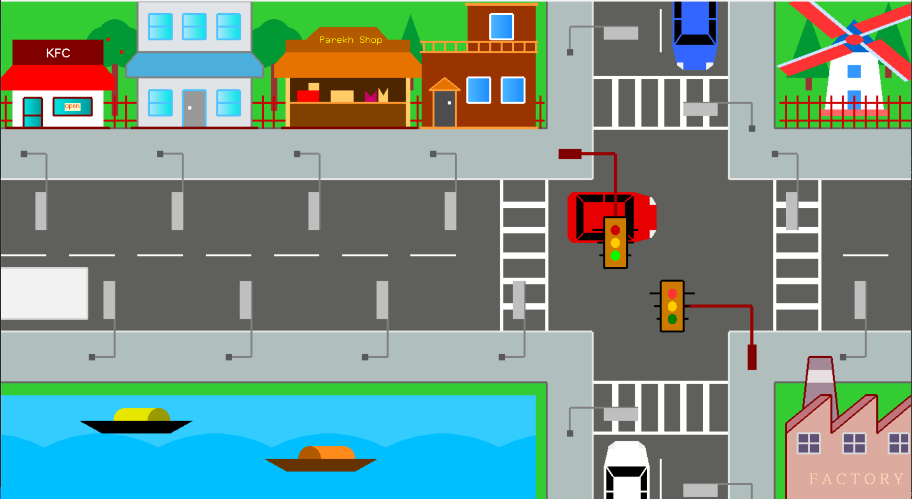
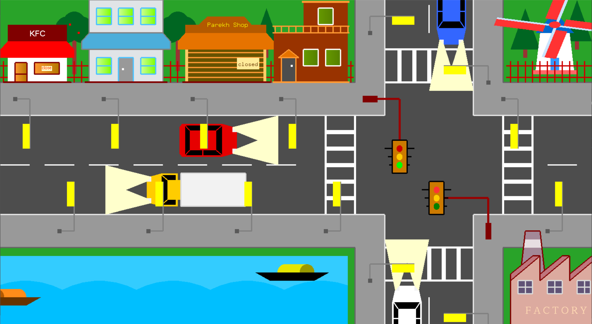

# 🚦 Traffic Signal in the City

*A 3D OpenGL Simulation Project by Pranav Landge & Team*

---

## 🧩 Overview

This project simulates a **traffic signal system** using **OpenGL (FreeGLUT)** in C++.
It showcases:

* Dynamic rendering of roads, vehicles, and signals
* Day and night transitions
* Realistic light and rain effects
* Basic audio (rain sound using `PlaySound()`)

---

## 🧰 Tech Stack

| Component            | Description                      |
| -------------------- | -------------------------------- |
| **Language**         | C++                              |
| **Graphics Library** | OpenGL + FreeGLUT                |
| **Audio**            | Windows Multimedia (`winmm.lib`) |
| **Compiler**         | GCC (MinGW-w64 via MSYS2)        |
| **Platform**         | Windows 10/11 (64-bit)           |

---

## 🖼️ Demo

| Day View                         | Night View                           |
| -------------------------------- | ------------------------------------ |
|  |  |

---

## ⚙️ Setup Instructions

### 1️⃣ Install MSYS2

Download and install MSYS2 from:
👉 [https://www.msys2.org](https://www.msys2.org)

Then open **MSYS2 MinGW64** (not PowerShell or CMD) and update packages:

```bash
pacman -Syu
# Close and reopen MSYS2 MinGW64
pacman -Su
```

---

### 2️⃣ Install Dependencies

Run these commands in the MSYS2 MinGW64 terminal:

```bash
pacman -S mingw-w64-x86_64-gcc
pacman -S mingw-w64-x86_64-freeglut
pacman -S mingw-w64-x86_64-gdb
```

---

### 3️⃣ Clone the Repository

```bash
cd /d
git clone https://github.com/<your-username>/Traffic-system.git
cd Traffic-system
```

> Replace `<your-username>` with your GitHub username.

---

### 4️⃣ Build the Project

Compile using:

```bash
g++ src/main.cpp -Iinclude -Llib -lfreeglut -lopengl32 -lglu32 -lgdi32 -lwinmm -o main.exe
```
OR
```bash
g++ src/main.cpp -o main.exe -lfreeglut -lopengl32 -lglu32 -lgdi32 -lwinmm
```

**Explanation of flags:**

| Flag         | Purpose                              |
| ------------ | ------------------------------------ |
| `-lfreeglut` | Links the FreeGLUT library           |
| `-lopengl32` | Links OpenGL core                    |
| `-lglu32`    | Links GLU utility library            |
| `-lgdi32`    | Links Windows GDI (graphics)         |
| `-lwinmm`    | Links Windows Multimedia (for sound) |

---

### 5️⃣ Run the Simulation

```bash
./main.exe
```

✅ A window will appear displaying the traffic simulation in action.
Make sure `rain.wav` is present in the same directory for sound effects.

---

## 📂 Project Structure

```
Traffic-system/
 ┣ include/
 ┃ ┣ GLFW/
 ┃ ┣ glad/
 ┃ ┣ KHR/
 ┃ ┗ winbgim.h
 ┣ lib/
 ┃ ┣ libbgi.a
 ┃ ┗ libglfw3dll.a
 ┣ src/
 ┃ ┗ main.cpp
 ┣ bin/Debug/
 ┃ ┣ Traffic signal in the city.exe
 ┃ ┗ rain.wav
 ┣ main.exe
 ┗ README.md
```

---

## 🧪 Troubleshooting

| Error                                             | Cause                 | Fix                       |
| ------------------------------------------------- | --------------------- | ------------------------- |
| `undefined reference to '__imp_glBegin'`          | Missing OpenGL link   | Add `-lopengl32`          |
| `undefined reference to '__imp_glutInitWithExit'` | Missing GLUT link     | Add `-lfreeglut`          |
| `undefined reference to '__imp_PlaySoundA'`       | Missing sound library | Add `-lwinmm`             |
| `collect2.exe: error: ld returned 1 exit status`  | Link order issue      | Use command above exactly |

---

## 🧱 Optional: Create a Makefile

To simplify building, create a `Makefile` in your project root:

```makefile
main: src/main.cpp
	g++ src/main.cpp -Iinclude -Llib -lfreeglut -lopengl32 -lglu32 -lgdi32 -lwinmm -o main.exe
```

Then you can compile by running:

```bash
make
```

---

## 📜 Credits

**Developed by:**
Pranav Landge & Team.
K. K. Wagh Institute of Engineering Education & Research, Nashik